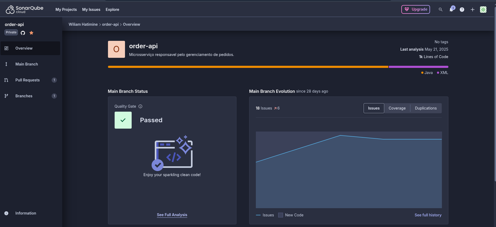
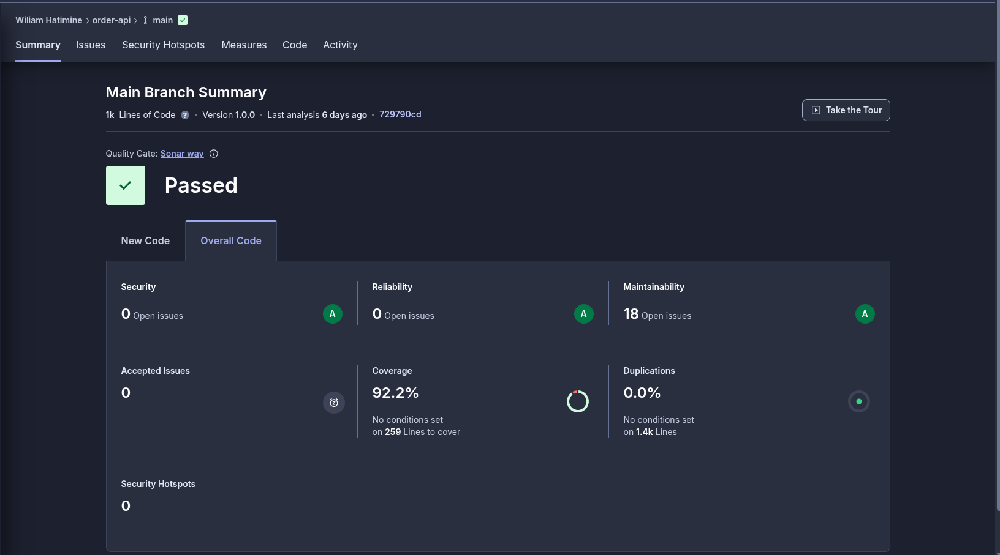
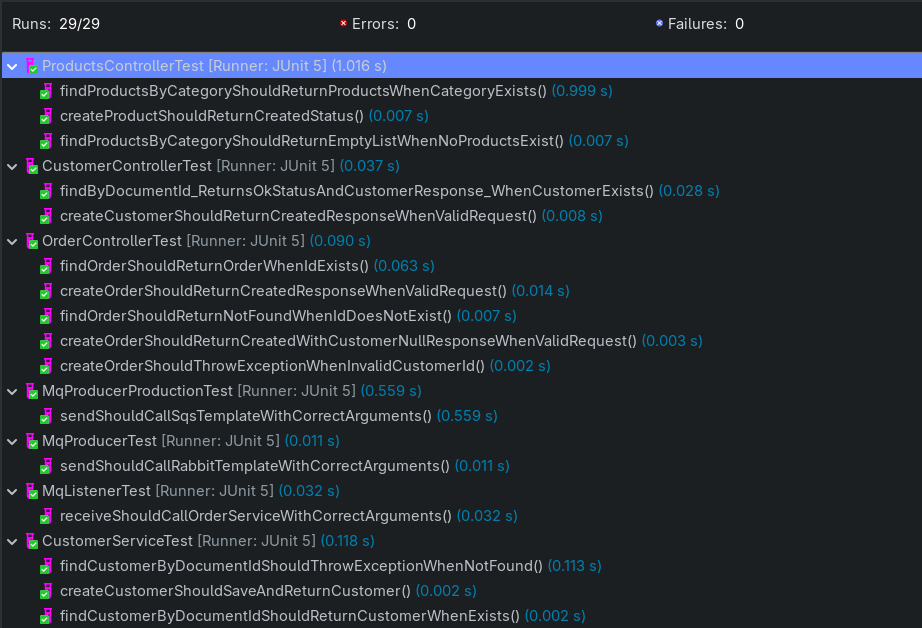
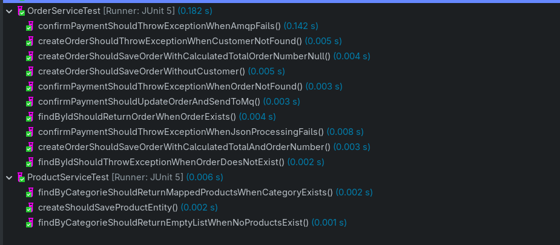
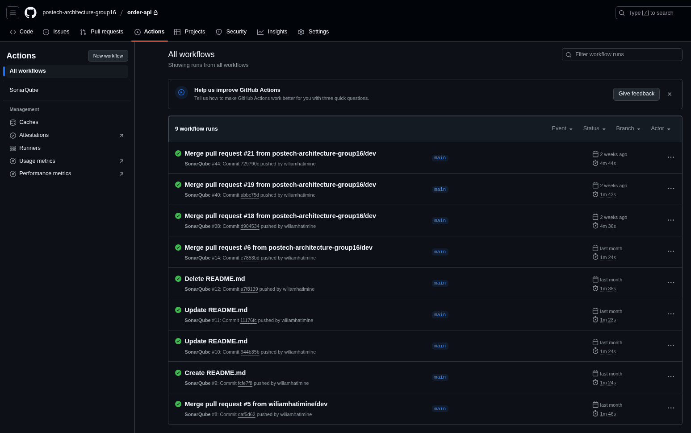

<h3 align="center">Microserviço de Pedidos</h3>

<h3 align="center">Descrição ⚡</h3>

<h3>Microserviço responsável pelo gerenciamento de pedidos e cadastramento de produtos.
<h3>

### 👨‍💼 Desenvolvido por

### Cobertura do Sonar

 

### Testes unitários

 
### Github Actions - Runs

